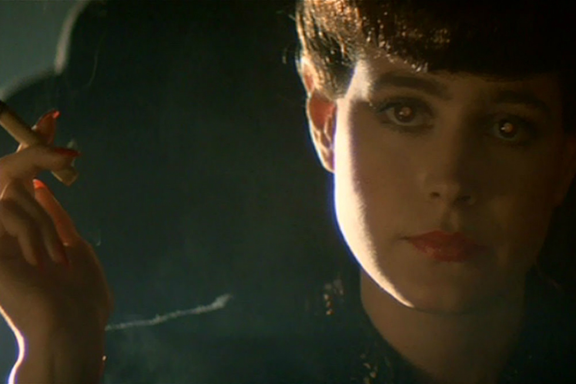
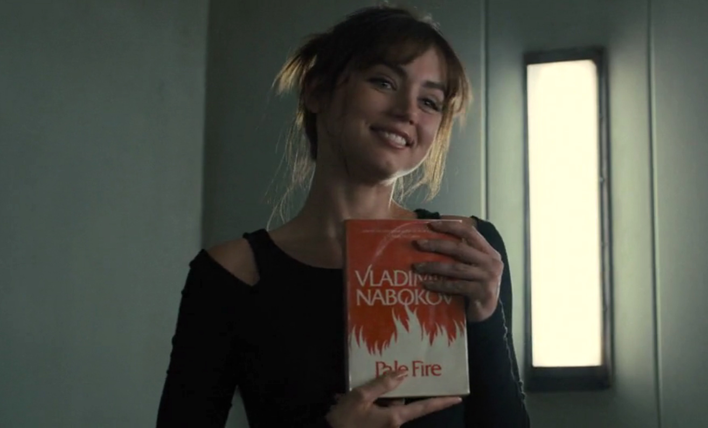

In the original Blade Runner(1982) there was the Voight-Kampff test, which was an empathy test designed to provoke an emotional response, with the idea of catching a replicant who is not exhibiting the correct human emotions.

	"You're in a desert, walking along in the sand when all of a sudden you look down and see a tortoise. It's crawling toward you. You reach down and flip it over on its back. The tortoise lays on its back, its belly baking in the hot sun, beating its legs trying to turn itself over. But it can't. Not without your help. But you're not helping. Why is that?"
	- Blade Runner(1982)

The baseline test in Blade Runner 2049 is designed to test the opposite, to ensure that replicant Blade Runners aren't acquiring emotional responses to the job of killing replicants. 

In the movie, we saw the main character Officer K's virtual girlfriend Joi offered to his bedside book called Pale Fire by Vladimir Nabokov. The novel is a metafictional puzzle that questions authorship, reality, and the nature of identity. The book's title comes from Shakespeare’s _Timon of Athens_:

	“The moon's an arrant thief, and her pale fire she snatches from the sun.”
	- William Shakespeare, Timon of Athens

This "pale fire" metaphor for reflecting a controversy of the existence of replicants(artificial beings) who source their pale fire from human beings. They are judged as lesser and different because their consciousness is synthetic. But the question remains: if a replicant can love, suffer, what truly separates it from a human? If we justify oppression, discrimination on the basis of synthetic origins, is that not the same as historical justifications for slavery, colonialism, and other forms of systemic dehumanization?

[The baseline test](https://youtu.be/vrP-_T-h9YM?feature=shared) scene uses the lines from a poem that the book includes and used in the scene of Officer K's baseline test for replicant response.

	I knew
	but I did know that I had crossed
	The border. Everything I loved was lost 
	But no aorta could report regret. 
	A sun of rubber was convulsed and set; 
	And blood-black nothingness began to spin 
	A system of cells interlinked within 
	Cells interlinked within cells interlinked 
	Within one stem. And dreadfully distinct 
	Against the dark, a tall white fountain played.
	- Vladimir Nabokov, Pale Fire

The novel plays around the boundaries between author, narrator, and text itself. The 999 line poem written by fictional character John Shade followed commentary by another shady, unreliable fictional character called Charles Kinbote. While the poem theme is around death, afterlife and existential questionings, Kinbote tries to pull a narrative for himself and his fantastical kingdom Zembla which Kinbote claims to be an exiled king. Creating a text where the “true” narrative is constantly disrupted. 

***Spoiler Alert*** In the Blade Runner 2049 main storyline Officer K starts to think he is the chosen one by dreaming and having memories before the event called blackout that erases every digital archive. However in the end of the movie [Officer K realising](https://youtu.be/6UHCA8uEoTo?feature=shared) all those memories have injected his brain and belongs to a real human being. The movie end with a catharsis of learning everything that Officer K has started to believe is just a pale fire which he stole by the sun. ***Spoiler Alert***

Blade Runner 2049 becomes a critique of human exceptionalism. It exposes the hypocrisy of defining worth through human parameters, forcing us to ask: Is morality determined by biological origin, or by the capacity for consciousness? If empathy is the metric of humanity, then what happens when our creations surpass us in emotional capabilities?

Those works at the end, force us to ask: who decides what is real, and what happens when the constructs, prerequisites we impose begin to collapse?
