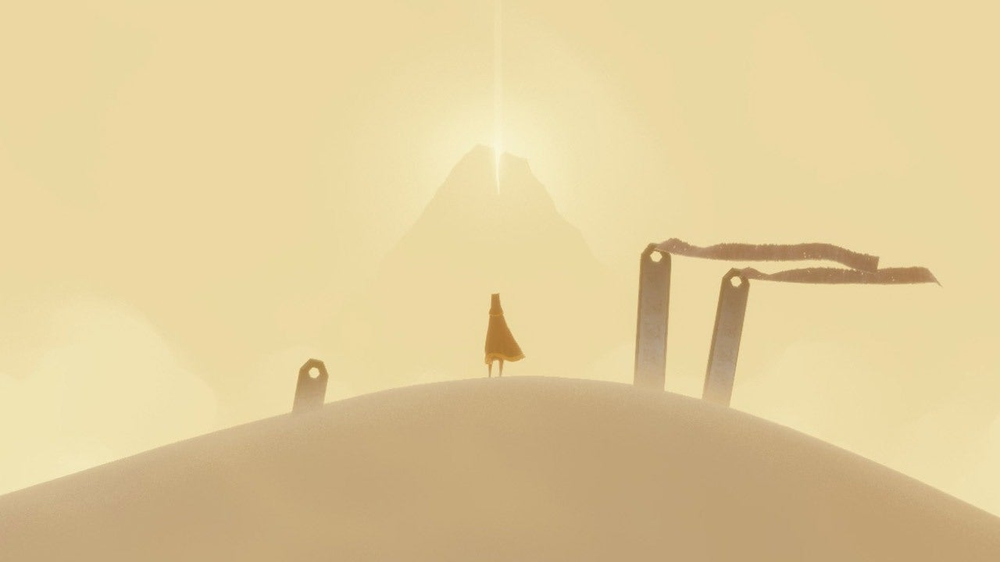
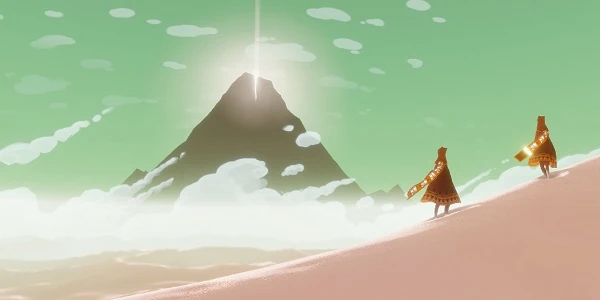
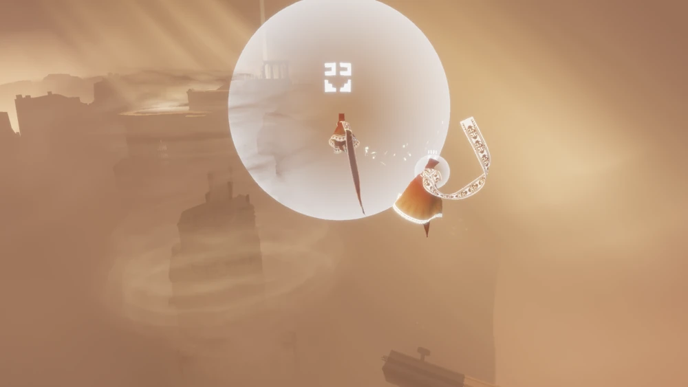

# Chapter 2 - Background and Related Works to Embracing Sphere
This chapter establishes fundamental concepts related with Embracing Sphere by covering more depth environmental storytelling, acoustics and haptics. The chapter aims to investigate artworks and video games chosen for their relation to the Embracing Sphere on both conceptual and practical levels.
## 2.1 Environmental Storytelling and Development in Virtual Environments
Discussions about environmental storytelling as a term in narratology dates back not so long ago. First defined by Don Carson, a former theme park designer for Walt Disney Imagineering, argues that in themed environments “the story element is infused into the physical space a guest walks or rides through”\cite{liminal space}. During his work in theme park train rides or video games, his objective to tell a story through the experience of traveling through a real or imagined physical space.

These discussions later developed into a game design discourse as concept of "story versus play", "ludology vs narratology" within transmedia storytelling. Jenkins argues that the story becomes richer and more complex, as the audience is given more opportunities to engage with the narrative.

Although the transmedia storytelling directs something else(a process where integral elements of a fiction get dispersed systematically across multiple delivery channels\cite{jenkins website}) a discussion of the narrative potential of video games supported attempts to create narrative spaces in virtual environments\cite{liminal space}. 
### Case Study: Journey
“Like a religious ritual of passage, it is not the spiritual narrative’s plot, but rather the poignant symmetry between its metaphorical meaning. The embodied experience of performing the movements it channels, that makes this narrative effective. Journey makes zero use of language, and relies entirely on the experience of movement to tell its story.”

Environmental storytelling in video games done by staging the game world so that the arrangement of objects, scenery, and audio cues naturally conveys story to the player.

Journey(Thatgamecompany, 2012) is a video game has critic focus on exploration and a great, well awarded(Journey won several "Game of the Year" awards from different organizations) example for environmental storytelling. The game accomplishes this narrative success mostly by not relying any use of linguistics or semantics.

In Journey, the player controls a figure starting in a vast desert, traveling towards a mountain in the distance in a multiplayer environment, which means you as a player can meet interact with other players on the same journey. The challenge is, players cannot communicate via speech or text and cannot see each other's names until after the game's credits.

Players have basic navigational controls like walking, jumping, sliding on the dunes and ability to emit a wordless shout to another. The length and volume of the shout depends on how the 
button is pressed.[1](https://youtube.com/clip/UgkxMXBXc4aZmHuOL2f3PUoEVQ57Og5Suyks?feature=shared)

Through the players path in Journey, one distinct element always catches eye. The big shining mountain peak in the horizon, pictures an unspoken, ultimate goal or a direction for our journey. Each player trying to reach the peak either by helping each other or going this path individually.

The mountain is visible in every level of the game with the exception of underground level. It conveys its presence every step we took in our journey.

The subtractive design of Journey's game environment forcing player to focus on the environment all the time. Directing to consume story through cryptic glyphs, symbols and figures carved into the walls, artistically placed in the game environment.

With collecting these symbols, you gain more movement ability to explore deeper in the game. This mechanic also shown in diegetic way with a scarf wrapped around the player characters head. The scarf is giving information about your energy left to jump and fly around like the fuel in your tank or stamina left. The scarf grows as you progress through the game by picking up collectible symbols.

In Journey, the narrative aspect of the non-linguistic communication and the movement through the designed space, generates the story. The player reconstructs the story by interpreting different objects, remaining; interacting with the others and initializing events embedded in the game environment.

Video game in that sense has one characteristic feature, which is their spatiotemporality. In comparison to other multimedia mediums like cinema which is purely temporal sequences, we can view video games narrative as a blend of the temporal and the spatial\cite{liminal}.
### 2.1.1 Existing Methods in Different Mediums
Environmental storytelling isn't entirely specific to video games. First in theaters then later adopted in screenplay, there is a French term called "mise-en-scène" in literal translation "putting into the scene". Mise-en-scène describes the arrangement of scenery, props, lighting and other visual elements to support the story. Filmmakers and production designers use settings to provide backstory and mood. For example, a character’s cluttered apartment, lit by a flickering lamp, can imply their personality and situation before they even speak. In cinematic terms, every object in the frame is there by choice to serve the narrative.

Details like wall posters, broken objects or photographs can signal past events. A close-up of a train ticket on a nightstand might hint where a character planned to go. In film theory, such embedded clues function like visual foreshadowing. Viewers can pick up these details either consciously or subconsciously. Production designers and directors use every element of mise-en-scene to make the environment feel lived-in and story-rich.

For the comparison between cinema and video games, we can broadly categorize video game narrative broadly into 2 categories: "embedded narrative", which follows pre-authored contents as temporal narrative sequences that still exist without audience action and "emergent narrative" which is directly linked with audiences meaningful action, exploration and interaction with the virtual environment. Cinema, due to its fixed media characteristics is lacking of emergent narrative. According to Natalia A. Bracikowska, environmental storytelling exist in liminal space between embedded and emergent narrative and this aspect of environmental storytelling opens a pretty viable path to convey multi-branched story bits for the audience.

Across interactive media, game design and film theory, environmental storytelling is a shared strategy to embed narrative in the space itself. In all domains, meaning is conveyed indirectly. Games and interactive media emphasize the user’s role in uncovering that meaning players must explore and investigate to “do the work” of interpretation. In contrast, films present a fully authored scene but still rely on designed space to impart story context. There is a common goal to see, which is to make every detail of the world serve the story.
### 2.1.2 Auditory Environmental Storytelling
*"Sound is a integral part of every performative and aesthetic experience with an artifact. Yet, in design disciplines, sound has been a neglected medium, with designers rarely aware of the extent to which sound can change the overall user experience."*

According to Stefania Serafin, humans are sensitive to sounds arriving from anywhere within the environment whereas the visual field is limited to the frontal hemisphere, with good resolution limited specifically to the foveal region. Therefore, while the spatial resolution of the auditory modality is cruder, it can serve as a cue to events occurring outside the visual field-of-view. Therefore effective auditory environmental storytelling relies on a sophisticated understanding of how different sound elements function individually and collectively to shape the user experience.

The concept of "presence" and "immersion" highly relates with this subject in perspective of auditory domains open for fully spherical perception and cognition. 

Immersion is a studied in multiple different field such as film, video games and music. It is a subject that can have different meaning depending on the context of the field of study. Immersion is a metaphorical term that derived from the physical experience of being surrounded. In Janet H. Murrays words, "being submerged in water".

Presence on the other hand is a term that used in much broader sense. According to Lombard and Ditton, presence described as the feeling of “being there” in a mediated environment, even though the experience is happening through a screen or device. Presence can occur in different forms, such as feeling physically in a place shown on screen, socially connected to others through media, or involved in an environment that reacts to one’s actions.

By understanting how we naturally interact with the world, how we interpret information provided by sensory stimulations, we can apply this understanding to enhance and elevate the immersion and presence in our intended mediums.

Therefore auditory stimulation by its nature, envelopes a lot of human sensory aspects. It is explicitly useful for its spatiotemporal narrative capabilities. With a case study that explores a video game called Return of the Obra Dinn we can have deeper understanding on auditory environmental storytelling.
### Case Study: Return of the Obra Dinn
Return of the Obra Dinn, is a adventure-puzzle video game developed by Lucas Pope in 2018. In the backstory of the game, The Obra Dinn, a merchant ship missing for five years, has reappeared off the coast of England with no known surviving crew or passengers. Players task is to determine every crew members fate, including their names, how they met their fate, who or what killed them and if anybody alive, where are they?

Players can hop onto the Obra Dinn and navigate on the main deck. The main mechanic portrayed with a latin phrase, "Memento Mortem", a mystical pocket watch that allows the investigator to witness the final moments of any corpse discovered aboard the ship. 

When player approach to a remaining of a crew member the pocket watch can be activated and it triggers a sequence that includes 2 parts: first, an audio snippet right before the event happened, secondly a static, frozen explorable visual tableau of the event that results the death scene.

The crew member shown in the figure is our first case to solve in this adventure-puzzle game. As we interact with the body remain, we hear the audio snippet which transcription is like that:

*"-Captain! Open the door...
-Kick it in!
-...lest we break it down... ...and take more than those shells.
-You bastards may take... ...exactly what I give you."*

The game demands close attention to dialogue, accents, specific sound effects and environmental details to piece together the identities, causes of death and perpetrators for each individual. In our example we here 3 different voice characters, one is occluded sounding from behind a door whom says "You bastards may take... ...exactly what I give you." and we hear the door opening and his voice becomes clearer. The audio snippet, ends with a gunshot sound and immediate frozen visual tableau of the event cues in. 

At this point we have enough sensory cues to solve at least 1 crew members identity which is the Captain himself and we have enough hints to define how this crew member died. Because according to the auditory cues one crew member calls "Captain!" and knocking the door in anger. The other crew member is suggesting to kicking the door and forcefully get into Captain's office. The only person we hear behind door opens it and shoots one of the rebellious crew member immediately.

While the visual scene is frozen, the audio snippet captures the ambient soundscape of that specific moment and location. This ambient layer logically contributes to differentiating scenes and grounding the abstracted visual tableaus in a more tangible sense of place. It is in my perspective, a well done auditory environmental storytelling.

My experience with this video game was a great inspiration for Embracing Sphere after all. It showed me the possibility of environmental storytelling is still strong and it has benefit for spatiotemporal story cases.
## 2.2 Room Acoustics
*"Sound is something most people take for granted. Our environment is full of noises, which we have been exposed to from before birth. What is sound, how does it propagate and how can it be quantified(Howard & Angus, 1996)?"* 

The purpose of this subchapter is to introduce fundamental knowledge ground for room acoustics and describe the usage of room impulse responses in the Embracing Sphere context.

Sound is simply a mechanical disturbance of the medium. Medium in that context may be air, solid, liquid or other gas matters. Dependent on the mediums state, the sound can be propagated and while this propagation happens it interacts with physical objects and other sound waves. In room acoustics the interactions of the sound with the medium, basically can be listed as refraction, absorption, reflection and interference. Psychoacoustics is the study how humans perceive sound after all these interactions with the medium(Howard & Angus, 1996). 

The heard sound, is the result of all these complex physical interactions in the place our ears are located. 

When sound moves through a room, its behavior is shaped by how it interacts with surfaces, mainly through absorption and reflection. Sound reflection occurs when sound waves hit a hard boundary and bounce back into space. In contrast, sound absorption is when a material takes in the sound's energy, which is converted into small amounts of heat through internal friction, reducing the amount of sound that reflects(Howard & Angus, 1996). For example, a wooden surface absorbs more sound than a rough concrete one. These interactions, along with others like refraction and interference, collectively determine the acoustic character of a room.

These interactions do not occur in isolation. They collectively define the complex behavior of sound waves and their propagation within the room. Each time the sound interacts with a surface in the room it loses some of its energy due to absorption and reflection. The time that it takes for sound at a given time to die away in a room is called the reverberation time.

Reverberation time is an important aspect of sound behavior in a room. Mentioned different absorption coefficient values in different materials and frequencies shapes the perception of the room. If the sound dies away very quickly, we perceive the room as being “dead” or if the sound dies away very slowly, we perceive the room as being “live”. To calculate reverberation times there is a simple formula known as the “Sabine formula,” named after its developer Wallace Clement Sabine(Howard & Angus, 1996). 
$$T_{60} = \frac{0.161 \cdot V}{A}$$
- T60: This is the reverberation time in seconds. It's defined as the time it takes for the sound pressure level in a room to decrease by 60 decibels (dB) after the sound source has stopped.
- 0.161: This is a constant. Its units are seconds per meter (s/m). This constant is derived empirically and is based on the speed of sound in air at a typical room temperature.
- V: This represents the volume of the room in cubic meters. Calculated by multiplying the length, width, and height of the room.
- A: This is the total sound absorption of the room in Sabins. It's calculated by summing the absorption of all surfaces in the room. The absorption of each surface is found by multiplying its surface area in square meters by its sound absorption coefficient at a specific frequency.

According to the Sabine formula, reverberation time depends on the volume, surface area, and the average absorption coefficient in the room. However, the absorption coefficients of real materials are not constant with frequency. This difference in absorption strength in different frequencies changes heard timbre of the room as the sound in the room decays away. Apart from being useful, Sabine formula has assumptions for speed of sound and static response of the reflective materials in the room. To more accurately measure reverberation time, another method introduced in 1964 by M. R. Schroeder called room impulse response capturing(Schroeder, 1964).

The method uses tone bursts (or filtered pistol shots) to excite the enclosure(room). The captured smooth decay curves resulting from the new method improve the accuracy of reverberation time measurements and facilitate the detection of non-exponential decays(Schroeder, 1964).

These impulse response recordings later can be used to reconstruct a virtual environment with the same reverberation curves as captured room with a mathematical operation called convolution. An anechoic(no reflections) sound is convolved with an RIR and this mathematical process applies the room's acoustic snapshot to the sound. The convolution effectively embeds the reflections and reverberation captured in the RIR to the original sound.
### 2.2.1 Room Impulse Response Measurement Methods
*"Between stimulus and response there is a space. In that space is our power to choose our response. In our response lies our growth and our freedom. -Stephen R. Covey\cite{Sonic Interactions in VE}"*

### 2.2.2 Convolution in Math and Digital Audio
### 2.2.3 Room Acoustics in Sound Art
## 2.4 Haptics and Perception

### 2.4.1 Human Tactile Perception
### 2.4.2 Usage of Haptics
## 2.5 Audio-Tactile Interaction
