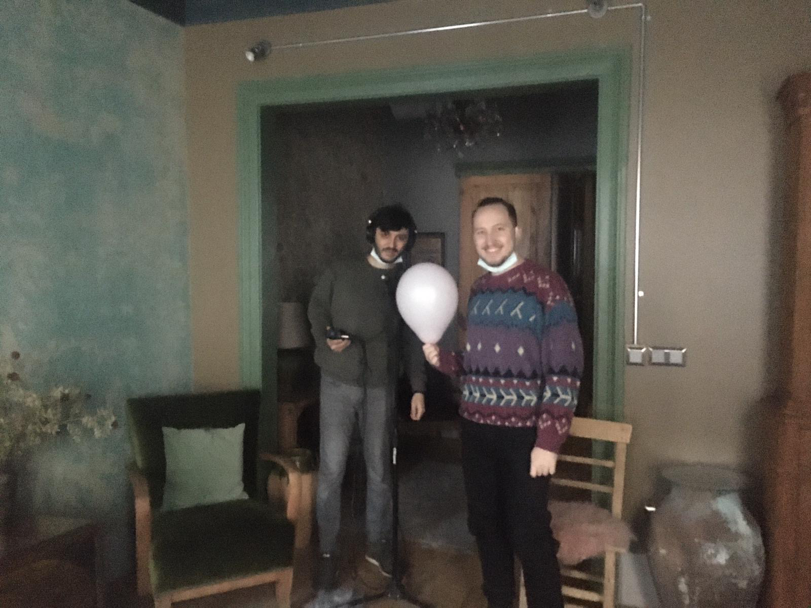
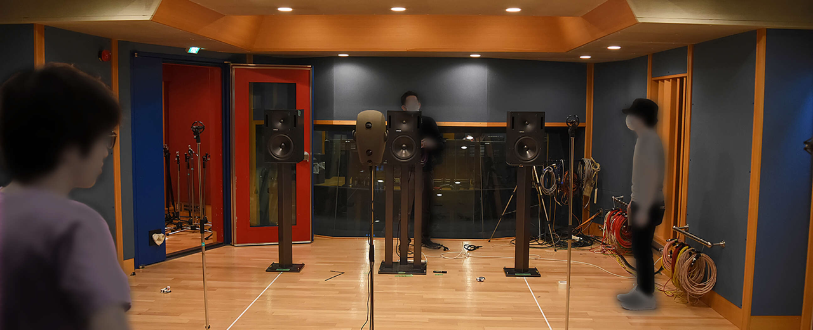
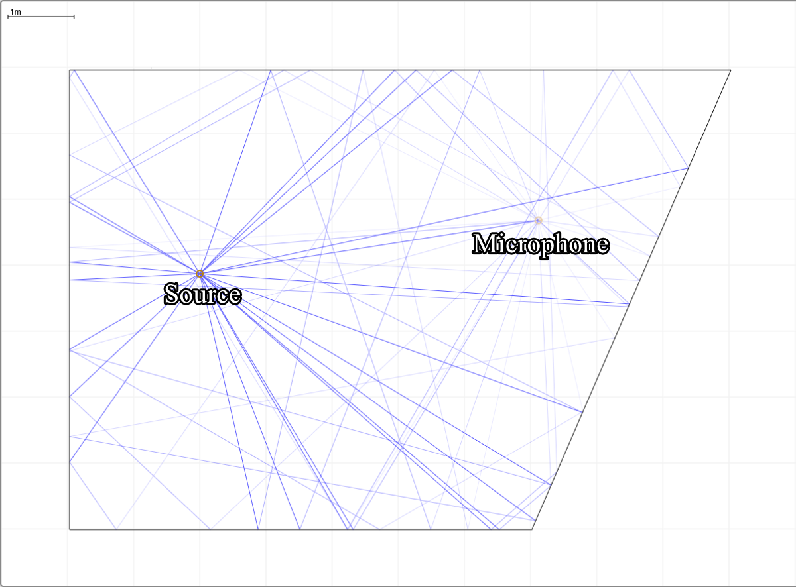
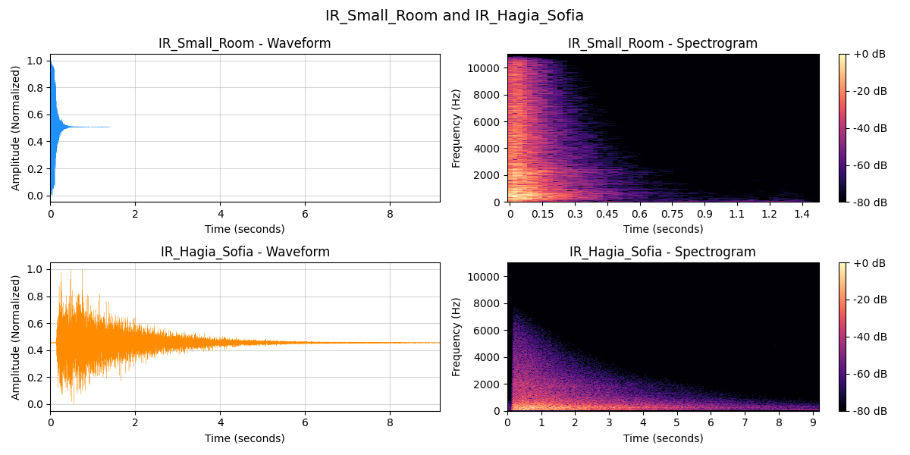
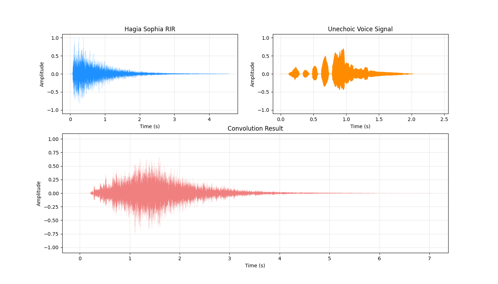
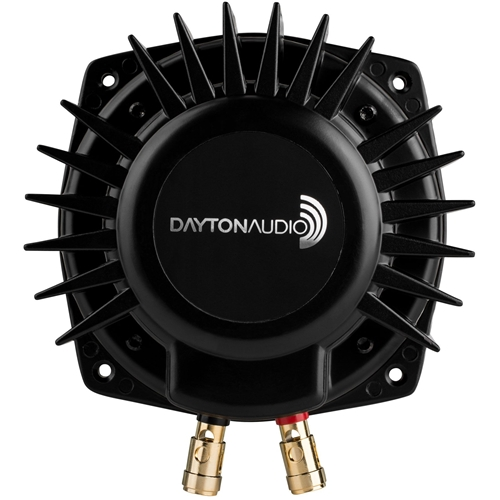

# Chapter 2 - Background and Related Works to Embracing Sphere
This chapter establishes fundamental concepts related with Embracing Sphere by covering more depth environmental storytelling, acoustics and haptics. The chapter aims to investigate artworks and video games chosen for their relation to the Embracing Sphere on both conceptual and practical levels.
## 2.1 Environmental Storytelling and Development in Virtual Environments
Discussions about environmental storytelling as a term in narratology dates back not so long ago. First defined by Don Carson, a former theme park designer for Walt Disney Imagineering, argues that in themed environments “the story element is infused into the physical space a guest walks or rides through”\cite{liminal space}. During his work in theme park train rides or video games, his objective to tell a story through the experience of traveling through a real or imagined physical space.

These discussions later developed into a game design discourse as concept of "story versus play", "ludology vs narratology" within transmedia storytelling. Jenkins argues that the story becomes richer and more complex, as the audience is given more opportunities to engage with the narrative.

Although the transmedia storytelling directs something else(a process where integral elements of a fiction get dispersed systematically across multiple delivery channels\cite{jenkins website}) a discussion of the narrative potential of video games supported attempts to create narrative spaces in virtual environments\cite{liminal space}. 
### Case Study: Journey
“Like a religious ritual of passage, it is not the spiritual narrative’s plot, but rather the poignant symmetry between its metaphorical meaning. The embodied experience of performing the movements it channels, that makes this narrative effective. Journey makes zero use of language, and relies entirely on the experience of movement to tell its story.”

Environmental storytelling in video games done by staging the game world so that the arrangement of objects, scenery, and audio cues naturally conveys story to the player.

Journey(Thatgamecompany, 2012) is a video game has critic focus on exploration and a great, well awarded(Journey won several "Game of the Year" awards from different organizations) example for environmental storytelling. The game accomplishes this narrative success mostly by not relying any use of linguistics or semantics.

In Journey, the player controls a figure starting in a vast desert, traveling towards a mountain in the distance in a multiplayer environment, which means you as a player can meet interact with other players on the same journey. The challenge is, players cannot communicate via speech or text and cannot see each other's names until after the game's credits.

Players have basic navigational controls like walking, jumping, sliding on the dunes and ability to emit a wordless shout to another. The length and volume of the shout depends on how the 
button is pressed.[1](https://youtube.com/clip/UgkxMXBXc4aZmHuOL2f3PUoEVQ57Og5Suyks?feature=shared)

Through the players path in Journey, one distinct element always catches eye. The big shining mountain peak in the horizon, pictures an unspoken, ultimate goal or a direction for our journey. Each player trying to reach the peak either by helping each other or going this path individually.

The mountain is visible in every level of the game with the exception of underground level. It conveys its presence every step we took in our journey.

The subtractive design of Journey's game environment forcing player to focus on the environment all the time. Directing to consume story through cryptic glyphs, symbols and figures carved into the walls, artistically placed in the game environment.

With collecting these symbols, you gain more movement ability to explore deeper in the game. This mechanic also shown in diegetic way with a scarf wrapped around the player characters head. The scarf is giving information about your energy left to jump and fly around like the fuel in your tank or stamina left. The scarf grows as you progress through the game by picking up collectible symbols.

In Journey, the narrative aspect of the non-linguistic communication and the movement through the designed space, generates the story. The player reconstructs the story by interpreting different objects, remaining; interacting with the others and initializing events embedded in the game environment.

Video game in that sense has one characteristic feature, which is their spatiotemporality. In comparison to other multimedia mediums like cinema which is purely temporal sequences, we can view video games narrative as a blend of the temporal and the spatial\cite{liminal}.
### 2.1.1 Existing Methods in Different Mediums
Environmental storytelling isn't entirely specific to video games. First in theaters then later adopted in screenplay, there is a French term called "mise-en-scène" in literal translation "putting into the scene". Mise-en-scène describes the arrangement of scenery, props, lighting and other visual elements to support the story. Filmmakers and production designers use settings to provide backstory and mood. For example, a character’s cluttered apartment, lit by a flickering lamp, can imply their personality and situation before they even speak. In cinematic terms, every object in the frame is there by choice to serve the narrative.

Details like wall posters, broken objects or photographs can signal past events. A close-up of a train ticket on a nightstand might hint where a character planned to go. In film theory, such embedded clues function like visual foreshadowing. Viewers can pick up these details either consciously or subconsciously. Production designers and directors use every element of mise-en-scene to make the environment feel lived-in and story-rich.

For the comparison between cinema and video games, we can broadly categorize video game narrative broadly into 2 categories: "embedded narrative", which follows pre-authored contents as temporal narrative sequences that still exist without audience action and "emergent narrative" which is directly linked with audiences meaningful action, exploration and interaction with the virtual environment. Cinema, due to its fixed media characteristics is lacking of emergent narrative. According to Natalia A. Bracikowska, environmental storytelling exist in liminal space between embedded and emergent narrative and this aspect of environmental storytelling opens a pretty viable path to convey multi-branched story bits for the audience.

Across interactive media, game design and film theory, environmental storytelling is a shared strategy to embed narrative in the space itself. In all domains, meaning is conveyed indirectly. Games and interactive media emphasize the user’s role in uncovering that meaning players must explore and investigate to “do the work” of interpretation. In contrast, films present a fully authored scene but still rely on designed space to impart story context. There is a common goal to see, which is to make every detail of the world serve the story.
### 2.1.2 Auditory Environmental Storytelling
*"Sound is a integral part of every performative and aesthetic experience with an artifact. Yet, in design disciplines, sound has been a neglected medium, with designers rarely aware of the extent to which sound can change the overall user experience."*

According to Stefania Serafin, humans are sensitive to sounds arriving from anywhere within the environment whereas the visual field is limited to the frontal hemisphere, with good resolution limited specifically to the foveal region. Therefore, while the spatial resolution of the auditory modality is cruder, it can serve as a cue to events occurring outside the visual field-of-view. Therefore effective auditory environmental storytelling relies on a sophisticated understanding of how different sound elements function individually and collectively to shape the user experience.

The concept of "presence" and "immersion" highly relates with this subject in perspective of auditory domains open for fully spherical perception and cognition. 

Immersion is a studied in multiple different field such as film, video games and music. It is a subject that can have different meaning depending on the context of the field of study. Immersion is a metaphorical term that derived from the physical experience of being surrounded. In Janet H. Murrays words, "being submerged in water".

Presence on the other hand is a term that used in much broader sense. According to Lombard and Ditton, presence described as the feeling of “being there” in a mediated environment, even though the experience is happening through a screen or device. Presence can occur in different forms, such as feeling physically in a place shown on screen, socially connected to others through media, or involved in an environment that reacts to one’s actions.

By understanting how we naturally interact with the world, how we interpret information provided by sensory stimulations, we can apply this understanding to enhance and elevate the immersion and presence in our intended mediums.

Therefore auditory stimulation by its nature, envelopes a lot of human sensory aspects. It is explicitly useful for its spatiotemporal narrative capabilities. With a case study that explores a video game called Return of the Obra Dinn we can have deeper understanding on auditory environmental storytelling.
### Case Study: Return of the Obra Dinn
Return of the Obra Dinn, is a adventure-puzzle video game developed by Lucas Pope in 2018. In the backstory of the game, The Obra Dinn, a merchant ship missing for five years, has reappeared off the coast of England with no known surviving crew or passengers. Players task is to determine every crew members fate, including their names, how they met their fate, who or what killed them and if anybody alive, where are they?

Players can hop onto the Obra Dinn and navigate on the main deck. The main mechanic portrayed with a latin phrase, "Memento Mortem", a mystical pocket watch that allows the investigator to witness the final moments of any corpse discovered aboard the ship. 

When player approach to a remaining of a crew member the pocket watch can be activated and it triggers a sequence that includes 2 parts: first, an audio snippet right before the event happened, secondly a static, frozen explorable visual tableau of the event that results the death scene.

The crew member shown in the figure is our first case to solve in this adventure-puzzle game. As we interact with the body remain, we hear the audio snippet which transcription is like that:

*"-Captain! Open the door...
-Kick it in!
-...lest we break it down... ...and take more than those shells.
-You bastards may take... ...exactly what I give you."*

The game demands close attention to dialogue, accents, specific sound effects and environmental details to piece together the identities, causes of death and perpetrators for each individual. In our example we here 3 different voice characters, one is occluded sounding from behind a door whom says "You bastards may take... ...exactly what I give you." and we hear the door opening and his voice becomes clearer. The audio snippet, ends with a gunshot sound and immediate frozen visual tableau of the event cues in. 

At this point we have enough sensory cues to solve at least 1 crew members identity which is the Captain himself and we have enough hints to define how this crew member died. Because according to the auditory cues one crew member calls "Captain!" and knocking the door in anger. The other crew member is suggesting to kicking the door and forcefully get into Captain's office. The only person we hear behind door opens it and shoots one of the rebellious crew member immediately.

While the visual scene is frozen, the audio snippet captures the ambient soundscape of that specific moment and location. This ambient layer logically contributes to differentiating scenes and grounding the abstracted visual tableaus in a more tangible sense of place. It is in my perspective, a well done auditory environmental storytelling.

My experience with this video game was a great inspiration for Embracing Sphere after all. It showed me the possibility of environmental storytelling is still strong and it has benefit for spatiotemporal story cases.
## 2.2 Room Acoustics
*"Sound is something most people take for granted. Our environment is full of noises, which we have been exposed to from before birth. What is sound, how does it propagate and how can it be quantified(Howard & Angus, 1996)?"* 

The purpose of this subchapter is to introduce fundamental knowledge ground for room acoustics and describe the usage of room impulse responses in the Embracing Sphere context.

Sound is simply a mechanical disturbance of the medium. Medium in that context may be air, solid, liquid or other gas matters. Dependent on the mediums state, the sound can be propagated and while this propagation happens it interacts with physical objects and other sound waves. In room acoustics the interactions of the sound with the medium, basically can be listed as refraction, absorption, reflection and interference. Psychoacoustics is the study how humans perceive sound after all these interactions with the medium(Howard & Angus, 1996). 

The heard sound, is the result of all these complex physical interactions in the place our ears are located. 

When sound moves through a room, its behavior is shaped by how it interacts with surfaces, mainly through absorption and reflection. Sound reflection occurs when sound waves hit a hard boundary and bounce back into space. In contrast, sound absorption is when a material takes in the sound's energy, which is converted into small amounts of heat through internal friction, reducing the amount of sound that reflects(Howard & Angus, 1996). For example, a wooden surface absorbs more sound than a rough concrete one. These interactions, along with others like refraction and interference, collectively determine the acoustic character of a room.

These interactions do not occur in isolation. They collectively define the complex behavior of sound waves and their propagation within the room. Each time the sound interacts with a surface in the room it loses some of its energy due to absorption and reflection. The time that it takes for sound at a given time to die away in a room is called the reverberation time.

Reverberation time is an important aspect of sound behavior in a room. Mentioned different absorption coefficient values in different materials and frequencies shapes the perception of the room. If the sound dies away very quickly, we perceive the room as being “dead” or if the sound dies away very slowly, we perceive the room as being “live”. To calculate reverberation times there is a simple formula known as the “Sabine formula,” named after its developer Wallace Clement Sabine(Howard & Angus, 1996). 
$$T_{60} = \frac{0.161 \cdot V}{A}$$
- T60: This is the reverberation time in seconds. It's defined as the time it takes for the sound pressure level in a room to decrease by 60 decibels (dB) after the sound source has stopped.
- 0.161: This is a constant. Its units are seconds per meter (s/m). This constant is derived empirically and is based on the speed of sound in air at a typical room temperature.
- V: This represents the volume of the room in cubic meters. Calculated by multiplying the length, width, and height of the room.
- A: This is the total sound absorption of the room in Sabins. It's calculated by summing the absorption of all surfaces in the room. The absorption of each surface is found by multiplying its surface area in square meters by its sound absorption coefficient at a specific frequency.

According to the Sabine formula, reverberation time depends on the volume, surface area, and the average absorption coefficient in the room. However, the absorption coefficients of real materials are not constant with frequency. This difference in absorption strength in different frequencies changes heard timbre of the room as the sound in the room decays away. Apart from being useful, Sabine formula has assumptions for speed of sound and static response of the reflective materials in the room. To more accurately measure reverberation time, another method introduced in 1964 by M. R. Schroeder called room impulse response capturing(Schroeder, 1964).

The method uses tone bursts (or filtered pistol shots) to excite the enclosure(room). The captured smooth decay curves resulting from the new method improve the accuracy of reverberation time measurements and facilitate the detection of non-exponential decays(Schroeder, 1964).

These impulse response recordings later can be used to reconstruct a virtual environment with the same reverberation curves as captured room with a mathematical operation called convolution. An anechoic(no reflections) sound is convolved with an RIR and this mathematical process applies the room's acoustic snapshot to the sound. The convolution effectively embeds the reflections and reverberation captured in the RIR to the original sound.
### 2.2.1 Room Impulse Response Measurement Methods
*"Between stimulus and response there is a space. In that space is our power to choose our response. In our response lies our growth and our freedom.\cite{Sonic Interactions in VE}"*

The quote above is highly controversial because it has been referred to an Austrian neurologist and psychologist, Viktor Frankl by Stephen R. Covey in his book called The Seven Habits of Highly Effective People but quote that referred to Frankl's book, Man’s Search for Meaning hasn't got any line that includes the quote. Although I wanted to share this quote as a poetic mood setter for this chapter. 

From an artistic perspective, Embracing Sphere refers to this metaphorical concept of relation between stimulus and response of space. Either directly or metaphorically it is powerful representation in spatial perception. Embracing Sphere is about creating an environments/spaces that are capable of telling stories. These spaces should contain both stimulus and response. Although in Embracing Sphere audience doesn't have power of choice, space has because space contains a lot to tell. The response of the space, grows and establish its freedom.

Acoustics, mathematics, methodologies around it can be covered so deep in details but in the end all of these descriptions and formulas exist in my research to support my artwork to understand the background and design choices of the Embracing Sphere. Therefore RIRs are important in my artwork to give acoustic and spatial context to the audience. It is useful to render the depth and the aural character of the environment into audio.

In previous sections we covered room impulse response description in surface level. It is a captured audio file that contains acoustics space characteristics such as frequency changes, reverberation decay and length.

There are several practical ways to capture RIR of a room. The easiest one is popping a balloon in the desired room and recording the balloon pop. This method is practical but not much accurate and it is not easy to recreate again because every balloon pop sound parameters can be differ in frequency-wise\cite{}. The more accurate method is sine sweep technique\footnote{\url{https://youtu.be/1egKAtC16e8?feature=shared}}, which includes 1 reference sine wave sweep audio (5-10 seconds long) that starts from 20Hz and sweeps every frequencies until 20kHz\cite{}. In this method the room is acoustically excited by this sine wave and with a microphone the room response recorded then processed with a mathematical process called deconvolution that extracts RIR with subtracting reference sine sweep from reverberant recording.

The visual above is  a recording session in 2021 when I was working as an audio designer in a company called Vadi Sound. In that frame we were capturing RIR with balloon popping in an old house in Balat, Istanbul. The house specifically interesting for capturing RIR because it was one of the few historical wooden houses remain in the Istanbul from early Turkish Republic times. In that situation we hadn't got a high quality full range speaker to excite the room so we choose to pop a balloon at several places in the room to capture as many different positions RIR.

An RIR capturing session that using sine sweep method can be seen in the figure above. The specific setup uses 2 omnidirectional microphone positioned in the A/B stereo miking technique()\cite{} and 1 binaural microphone to capture studio room impulse response. 

Either method works in basic principle shown in the figure above. A source that exciting the room and a capturing point that captures the room's acoustic character. From an artistic or design perspective we can see this process as taking an auditory snapshot of the room.

RIRs are artistically useful for virtual aural architecture. In real life architecture uses volumes to evoke intended emotion or paradigms. Some spaces can evoke feeling about privacy or loneliness, others can invite for social cohesion or some space can establish an hierarchy between different roles in the society\cite{}. Artistically I see enclosed spaces and its response as an actor in my story. Same dialog or sonic events can convey many different meanings and feelings according to environments relation with the stimulation.

To explain frequency difference and reverberation time affect in any sonic event, the 2 completely different character RIR waveform and spectrogram graphic shown above. As we can see at the left column in the graph, these 2 RIR files has quite different in length and density. 

First row is from a small room RIR shown above with a picture of mine holding a balloon. The length of this small room RIR is around 500ms which indicates small volume and highly absorbent environment with carpets on the floor, many cushions and curtains. 

The second row is from architecturally and historically famous Hagia Sofia in Istanbul built in 6th century. The Byzantine church Hagia Sophia transformed into a mosque after conquest of Constantinople (modern day Istanbul) by Ottoman Empire in 1453 and functioned as a mosque until it transformed into a secular museum with the political and social reforms made in 1935 under Mustafa Kemal Atatürk then reverted back into a mosque in 2020 by Turkish government to support their religious ideologies and symbolic political endeavors\cite{}. This iconic wonder has stood against time and many diverse cultural influences. 

To study the acoustics of old Byzantine churches and mosques built by famous architect Sinan (known as Mimar Sinan) the CAHRISMA project (Conservation of the Acoustical Heritage by the Revival and Identification of the Sinan’s Mosques Acoustics) started in 2000\cite{}. In this project, sine sweep technique used, a omnidirectional loudspeaker emits a sinusoidal sweep signal in the Hagia Sophia and the response of the environment is simultaneously recorded with a microphone. The sweep response is then deconvolved with the reference sweep signal.

The RIR of Hagia Sophia then the analyzed and full acoustic model built in an acoustic software called ODEON\cite{}. This model can simulate auralization of any anechoic sound inside Hagia Sophia in different positions and the aural difference between Hagia Sophia as a mosque (with carpet floor and wooden panels with Arabic inscription) and Hagia Sophia as a church (mainly marble floor, stone walls)\cite{}.

As we see the shown in the figure above Hagia Sophia's reverberation time is much longer than than our small room, around 6-8 seconds. The frequency response of both of the examples also shown in the figure \ref{}. The frequency response also depends on volume, absorption coefficient and affects the heard sound dramatically. High frequencies are easier to absorbed by air and surfaces\cite{} in the room and this can be seen in the figure \ref{} as a colorful slope in the spectrogram panels in the right column.

In artistic view, ability to snapshot an environment and using for creating virtual environments highly interesting and useful for my perspective. Using RIRs to develop such virtual environments require a specific signal processing called "convolution". The next section will cover the practical mathematical description of convolution and its capabilities in digital audio.
### 2.2.2 Convolution in Math and Digital Audio
Convolution is a mathematical operation that combines two functions to produce a third function. This new function expresses how the shape of one function is modified by the other. In simple terms, convolution tells us how one signal changes when it passes through a system described by another signal. The convolution algorithm is often interpreted as a filter, where the kernel filters the feature map for certain information\cite{}.

We can say that convolution is fancy multiplication. It is important in physics and mathematics as it defines a bridge between the spatial and time domains and the frequency domain through the convolution theorem. Convolution is essentially used in computer graphics, digital signal processing and lately in machine learning algorithms.
$$(f \ast g)(t)=\int_{-\infty}^{\infty} f(\tau) g(t-\tau) d \tau$$
The above formula is the formal definition of convolution operation. Instead of starting a calculus lecture, we can present a metaphoric example to deepen our understanding:

Let's say you are running a restaurant. In this restaurant you have a fixed menu and your kitchen uses 2 eggs for one meal. In monday rush hour, 10 meals are ordered in the first hour, 11 in the second, and 12 in the third. How many eggs did you used? It's simple multiplication. 
$$(2\cdot10)+(2\cdot11)+(2\cdot12)=66$$
The answer is 66 but in Tuesday your chef added a dessert that requires an egg to make. Desserts are getting served after 1 hour of each meal. How many eggs you use for each hour? This is now a complex problem because the eggs amount overlaps after first hour.

First hour is simple you prepare initially 10 meals with 2 eggs each $$2\cdot10=20$$Then the next hour you have to prepare 11 meal but also 10 desert for the visitors from first hour $$(2\cdot11)+(1\cdot10)=32$$The third hour after your last visitors came you have to prepare 12 meals and additional 11 desserts for the second hour visitors. $$(2\cdot12)+(1\cdot11)=35$$
And you overtime for the last visitors and serving 12 desserts. $$1\cdot12=12$$
To summarise all the details, 
- The Input (Orders): `[10 11 12]`
- The Plan (First meal, next hour dessert): `[2 1]`
- The Result (Total eggs used per hour): `[20 32 35 12]`
This calculation is an high level example for convolution operation. In digital audio with the lists that has at least 44100 samples per second\cite{}, much more convolution operations needed to convolve an input audio and a kernel impulse response. 

Convolution is a key tool for processing sounds. It is used to apply the characteristics of one sound (such as the acoustics of a room or the response of a speaker) to another sound (like a musical recording or a voice).

Convolution is also used in digital filters, such as equalizers and effects and in spatial audio to simulate how sound arrives at the ears from different directions. For example, by convolving audio with a _head-related transfer function_ (HRTF), we can make sounds appear to come from specific locations in three-dimensional space\cite

The visual explanation of convolution has shown in the figure \ref{}, where an anechoic voice signal and RIR from Hagia Sophia signal processed with convolution and the result indicated in the second row. The aural effect of convolution makes us to perceive singing voice is happening in a big reverberant church instead of an anechoic chamber.

Embracing Sphere utilizes this process to procedurally generate virtual acoustic environments and embed already existed narrative into various virtual spaces. Procedurally generating new snapshots of imaginary spaces that serves as environment which tells story. Procedural generation and the system behind will be covered in detail in Chapter 3 and 4.

Deriving from the technical perspective of acoustics and artistic approach with this acoustic technologies, in the next section usage of the room's acoustics as both medium and subject will be covered with a case study process-based art called "I am Sitting in a Room" from renown sound artist Alvin Lucier.
### 2.2.3 Room Acoustics in Sound Art
“I am sitting in a room different from the one you are in now.
I am recording the sound of my speaking voice and I am going to play it back into the room again and again until the resonant frequencies of the room reinforce themselves so that any semblance of my speech, with perhaps the exception of rhythm, is destroyed.
What you will hear, then, are the natural resonant frequencies of the room articulated by speech. I regard this activity not so much as a demonstration of a physical fact, but more as a way to smooth out any irregularities my speech might have.” - Alvin Lucier* 

The text above is from a sound art piece "I am Sitting in a Room". This work is widely recognized in experimental music and sound art scene as one of the most important pieces in the history of minimalist sound art\cite{}.

The artwork follows a simple iterative process. Lucier records himself reading the text at the start of this chapter, explaining exactly what is going to happen in the performance. In the iterative process, Lucier re-records this recording by playing back in a room with a speaker and a microphone. This process repeats over and over again, with each new iteration contains the previous recording and the acoustic interaction of the room\cite{}.

The room acts like a filter, emphasizing certain frequencies that match its natural resonances (modal frequencies of the room\cite{}) while reducing others. With each iteration, Lucier’s words become more blurred and the room’s acoustic characteristics become the leading aspect of the performance. Eventually, Lucier's speech transforms into pure tones that reveal the acoustic signature of the space itself. The transformation happens gradually in 45 minutes of tape\cite{}. 

This approach turns the space into an active participant in the composition, rather than an empty container for sound. It highlights our environments physical role in our artistic output. This concept has inspired many artist to consider the acoustic properties of spaces as a factor in their works\cite{}.

My inspiration that i derived from I am sitting in a room, was one of the driving forces in my research about auditory environmental storytelling. After I found out this artwork and took my time to digest the composition, I figured out that our surrounding environments has their own character and affect over the information we constantly perceive. This concept of environment as a narrator/actor has been utilized in cinema and video games but developing environmental storytelling without visuals or semantic structure intrigued me most. Thus Embracing Sphere promotes the space into main narrator role, through auditory or tactile sensory modes.

In summary the acoustic perception is important in Embracing Sphere. Next sections are going to cover haptics and human vibrotactile perception, detailed around Embracing Sphere and why haptics are an efficient sensory mode on perception and cognition.
## 2.3 Haptics and Vibrotactile Perception
Spatio-temporal narration can be done with many different sensory modalities but auditory and somatic senses are fundamentally need a temporal ground to be perceived and has capabilities on conveying spatial cues\cite{}. The temporal ground is basically the time required for our perceptual and cognitive systems to fully evaluate a stimulus\cite{}. In auditory medium we distinguish relative pitch, volume, amplitude, distance mostly through this temporal information and with this information we interpret the environment we stimulated by thus a spatial meaning created.

In haptics (somatic system) the human perception behavior is similar in many ways and the benefits of somatic stimulus on interpreting an environment is quite the same with the benefits of the auditory stimuli\cite{}.

Both of them can be studied and examined with same scientific subject "waves" because fundamentally both of them transferred via vibrations\cite{}. Some of the auditory concepts can be perceived with somatic system simultaneously such as rhythm perception\cite{}.

For Embracing Sphere, I intentionally chose the auditory and haptic modalities to use the ability of creating contrasts and harmonies within the same scenery. In my perspective, haptic stimulus mostly interpreted as intimate and close in distance. In the meantime auditory perception is the best way to convey the distance and localization, even better than vision because it's not constrained by our peripheral vision.

If you imagine my craft as a painter, I have ability to draw depth into my artwork much more efficient with audio-tactile stimulus.

To use this wide palette, this section: Haptics and Vibrotactile Perception, is going to investigate human haptic capabilities and benefits, later we are going to use this knowledge to create more detailed virtual environments and in the ultimate objective, to convey better environmental storytelling.
### 2.3.1 Overview of Haptics
The somatic system can be subdivided into three elements: kinesthetic, visceral, and cutaneous. Kinesthetic sensation uses signals from proprioceptors in the joints, muscles, and tendons to provide feedback to the brain on the position and forces within segments. Similarly, visceral sensation uses receptors in the abdomen. Cutaneous sensation consists of a combined response of four types of nerve endings in the skin(Mansfield, 2005). The haptic system uses sensory information derived from mechanoreceptors embedded in the skin, muscles, tendons and joints(Lederman, 2009).

Haptic interaction can be stimulated by different devices but such as thermal feedback and electro-vibration are outside the scope of this study thus a vibrotactile device chosen for this research purpose. These vibrotactile devices are similar to those of loudspeakers and voice coil actuators(Remache-Vinueza et al., 2021), allowing for conventional audio recording practices viable on haptic feedback content creation.

**Figure 1.08:** Voice coil actuator, vibrotactile device, Dayton Audio BST-1.

The sensory system is a network that enables your body to receive information from the environment and its own internal state, converting stimuli into signals for the brain to process. Human sensory system doesn't just process this sensory information as a single stream; it organizes it to answer fundamental questions about the environment(Reed et al,. 2005). Research in sensory neuroscience suggests a fundamental distinction in how the brain processes sensory information framed as "what" an object(disturbance) is versus "where" it is located.

How do you feel the difference between rough stone, resonant wood, or soft earth? This relates directly to identifying the "what" of the surrounding environment. The "where" pathway provides spatial information, helping us understand the location of a stimulus in relation to our body and within the environment. The location of a distant explosion felt through the floor, or the feeling of being in a small, enclosed space versus an open one? This is related to identifying "where" information.

Within the study that explores environmental storytelling through audio-tactile stimulation, we can extend this framework with a third component, "how". This component can include "cause and effect" relation into our sensory perception and cognition. Where "what" and "where" components answer material and spatial questions, "how" components can answer temporal questions derived from the first two components. Focusing on a more interactive concept of "event" rather than a static stimulation characteristics.

This "what, where and how" taxonomy provides a conceptual tool for environmental storytelling, thus embedding temporal relations into the environment, moving beyond simple rumbles to convey specific information about an environment's materials, spatial layouts and past/ongoing events.

**Figure 1.09:** A visual shows road rumble strips.

As shown in the Figure 1.09 rumble strips designed to alert drivers by creating vibrations and noise when a vehicle goes out from its intended lane or crosses the edge of the road. Stimulation from a rumble strip side of the road not just indicating physical position or a road surface information, it's an immediate warning. 

The sensation isn't a random patch of bad road; it's a deliberately engineered, rhythmic pattern. This pattern connects the what (the ribbed texture) and the where (the edge of the lane) to create a temporal meaning: "You are currently in the process of making a mistake." The "how" pathway interprets this sequence as a cause-and-effect event, because you are drifting, you are feeling this vibration. In a structured narrative context, this type of haptic stimulation can be utilized for environmental storytelling.
### 2.3.2 Human Tactile Perception
This section will cover human response to haptic stimulation, detection thresholds of vibrotactile stimulation in comparison with auditory perception. The questions such as:
- What is the detection thresholds of vibrotactile stimulation? 
- How vibrations effect material texture feeling of an object?
- How whole body vibrations affect our feeling?
- How vibration amplitude, frequency and frequency pitch intervals effect cognition?
- Which body parts or positions is effective in haptic stimulation most?
- How audio-tactile stimulation is effecting our localization capabilities?
These questions introduced in the context of Embracing Sphere to basically have a certain knowledge ground while crafting/designing content for Embracing Sphere. As ultimate goal is to convey an environmental storytelling through audio-tactile interface, it is crucial to explore and study haptics in detail. 

First answer defines tangible human limits and scales most effective playground for vibrotactile experience. Detection threshold of vibrotactile stimuli varies with frequency, transmission position and measurement conditions. Human response to vibration is multidisciplinary topic that involves many science such as biology, psychology, physics and biomechanics\cite{}.

People are primarily exposed to vibration either localized or vibration that affects whole body\cite{}. We experiencing our surroundings through these 2 different vibration ways. The question, "What is the required magnitude of a vibration for it to be perceived?" has to be restructured as "What is the required magnitude of a vibration in each frequency domain for it to be perceived by hand and whole body?". This restructuring embeds more accurate investigations in human response to vibration, assemble more useful data for Embracing Sphere. In many researches\cite{}\cite{}\cite{}, vibrotactile sensitivity of hand is highest (lowest threshold) at mid-range frequencies (40-150Hz) and decreases (threshold increases) at very low and very high frequencies (below 20 and above 400).

FIGURE

Whole body vibrations are important because humans are used to perceive whole vibrations in situations like being a passenger or driver in vehicles such as cars, trucks and helicopters; experiencing massive motions such as earthquake and waves in the sea\cite{}. Whole body vibration is a vibration that affects the whole body, perceptive result of a stimuli in brain is a sum of every somatic sensors of our body\cite{} and it may make us feel diverse feelings from nausea, sickness to refinement and rigidity\cite{}.

According to researches\cite{} perceived quality of an instrument is slightly affected by the vibration level of an instrument and according to other studies\cite{}\cite{}\cite{} vibrotactile perception of musical concepts (rhythm, pitch, melody cognition) is quite similar to auditory perception.

In the Audio-tactile Rendering experiment\cite{}, tactile renderings and perceptive effects on different type of auditory concepts such as rhythm, pitch, melody, timbre and loudness explored and in the Consonance of Vibrotactile Chords experiment\cite{}, musical theory involved in to express musical feelings of consonance and dissonance via vibrotactile interfaces. Both experiments are highly related with my research and Embracing Sphere.

According to study, tactile rhythm perception explained in a basic way of filtering the music signal and using filtered signal as an exciter for an actuator. Rhythm is described as pattern of pulses in discrete time and rhythm as a musical feature can be perceived by multiple sensory channels such as visual, auditory, and touch. 

Pitch perception with vibrotactile stimuli is a complex task as touch has frequency perception limitations. Simplest way is to translate pitch and loudness to vibrotactile stimuli, using speakers or VCAs which directly convert pitch to frequency and loudness to intensity of vibrations. However, frequency response of these actuators overpass skin perception thresholds we described, because of that information embedded in high-frequency bands (i.e., over 1000 Hz) might be lost.

Melody builds up as a suitable combination of pitch changes over time. Therefore, most of the limitations for pitch conversion also apply to melody.

Timbre allows the listener to differentiate between tones played from one or another musical instrument. Timbre relies on the frequency content called "overtones" (i.e., spectral content) of audio signals and overtones are frequencies of sound that are higher than the fundamental frequency of a vibrating object, which in a higher registry fundamental tone, an overtone series may start from higher than 600Hz. Therefore tactile translation of timbre represents a challenge.

The concepts derived from music theory and composition can be utilized for creating abstract but effective audio-tactile scenes where meaning is not so direct but more intuitive.

With an experimentation for localization of an event that perceived by both haptic and auditory senses create an illusion called ventriloquist effect\cite{}. The sum experience of simultaneous audio and tactile stimulation is going to covered in next section but while composing an audio-tactile experience, these perceptive concepts and illusions has to be taken into account. Being able to author feelings and embed meaning utilizing this concepts is a novel way of conveying a story in multimedia, in my perspective.
### 2.3.3 Haptics in Media Arts and Video Games
Both in media art scene and video game industry, immersion is occasionally an important subject. This section will cover several case studies in such domains that utilizing haptic feedback to translate an information, feeling or meaning.

**Case Study: Emoti-Chair**
The Emoti-Chair is an audio-tactile display designed to translate music, speech, and environmental noises into physical vibrations that can be felt on the body. This system is aimed at improving music accessibility for deaf and hard of hearing individuals, but it also offers a novel sensory experience for all users\cite{}.

IMAGE

This work physically and technically one of closer works to Embracing Sphere. Both of them in core concept translating audio signals into vibrotactile stimuli via an array of voice coils actuators embedded in a chair form factor.

IMAGE

Specifically Emoti-Chair using coils that have arranged in a two-column by eight-row array can be seen in the figure \ref{}, each corresponding to a specific frequency band. This spatial mapping allows users to feel different frequency components of sound at different locations on their body.

In one of the interview they have made\footnote{SmartLab TMU News, Emoti-Chair: \url{https://youtu.be/gA--cOs87p4?feature=shared}}, researchers explains the system and describing their work as its confirming the idea that music is essentially multi-modal and maybe even a-modal. 

Multimodal interfaces such as Emoti-Chair incorporate multiple forms of input and output to provide a variety of devices to support human-computer interactions. In further experiments researchers introduced Emoti-Chair to professional film-makers and singers in creating and experiencing tactile music on the Emoti-Chair\cite{}. They reported on responses to pre and post questionnaires that collected participant views about the workshop and about vibrotactile stimulation in general.

During workshops with professional film-makers, singers and artists, participants either composed vibrotactile music for the first time or experienced their voices as tactile vibrations through the Emoti-Chair. Across these diverse participants, the technology has received positive feedbacks, with strong interest in using it for future projects. Future directions include enabling artists to further explore tactile composition and developing new instruments specifically for vibrotactile music.

**Case Study: Movement and Impact**
*Up to six million vehicles a year pass through the Gotthard Road Tunnel, Switzerland's most important north-south traffic artery. “Movement and Impact” gives you a completely new feeling for the Gotthard Tunnel and the cars and trucks incessantly pouring through it.*

The quote above is taken from an artwork description named "Movement and Impact" co-created by Yvonne Weber, Sabine Haerri and the Ars Electronica Futurelab. I have discovered this artwork through a suggestion from my professor, Manuela Naveau and immediately I felt compelled to research further. It has exhibited in Ars Electronica Festival in 2009 and unfortunately I have no chance to experience again. I will do my best to explain the piece using the resources and visuals I have found online.

IMAGE

In this artwork, the artists translated the heavy flow of vehicles passing through Switzerland's Gotthard Road Tunnel into a tactile experience. Sensors laid on the ground captured real‑time data on traffic volume, vehicle size, weight, and direction. That data converted into gentle, rhythmic vibrations on a reclining platform\cite{}. 

IMAGE

In Movement and Impact, artists explored the translation of digital traffic data into a physical experience. Through transforming overwhelming, invisible data, they created an experience somehow intimate, tangible and even therapeutic.

IMAGE

Coincidentally I have chosen a similar practice for haptic content creation for Embracing Sphere. I recorded a bridge rumble which is emotionally close to me, Neue Eisenbahnbrücke in Linz.

IMAGE

Since starting my master’s studies at the University of Art and Design Linz, Linke Brückenstraße was my first place of accommodation and for a year and a half, I crossed this bridge nearly every morning and night. Sometimes I sat and listen waves, sometimes I put my headphones on and just feel the heavy rumble of big metal frames of this beautiful bridge. 

Eventually, I decided to document my experience in an auditory way. However, the experience of this bridge is far from purely auditory, so I grabbed my geophone (an electronic seismic recording device) and recorded the bridge’s rumble and the vibrations caused by passing vehicles.

IMAGE

In conclusion, Movement and Impact was not something I knew about before making these recordings or starting to develop Embracing Sphere. However, researching this artwork has convinced me to continue along this path. I may be on the right track to express my own experience. The original files of this recording session will be used in Embracing Sphere content.

**Case Study: Exclusive Games**
Both Nintendo Switch and PlayStation consoles have unique controllers. Joy-Cons for Nintendo Switch and DualSense/DualShock for PlayStation, both of them features advanced haptic feedback technologies. Many exclusive games are designed to take advantage of these features such as Astro's Playroom and 1-2 Switch.

IMAGE

Astro's Playroom is an exclusive PS5 tech demo for the DualSense. In Astro's Playroom player can feel the texture of sand, the grittiness of ice and the tension of bow spring. Rainfall is simulated as tiny, distinct taps and pulling a bow uses adaptive triggers for realistic tension.

PS5 DualSense utilizes voice coil actuators and adaptive triggers to produce complex vibration signals. Each side of the controller, there is a combination of a vibrotactile actuator, designed by Foster Electric\footnote{Commercial video of VCA from Foster Electric: \url{https://www.foster-electric.com/products/productdata/vibration_actuator_en.mp4}}.

IMAGE

1-2 Switch is a party game is essentially a tech demo or a showcase for HD Rumble. 1-2 Switch includes many mini games. In the “Ball Count” mini game, you “feel” virtual balls rolling inside the controller, simulating their number and movement, the "Shave" mini game, players hold the Joy-Cons as if they are a barber clipper and the Joy-Cons vibrating like the feeling of shaving facial hair. The goal is to shave a virtual beard by moving the Joy-Con in shaving motions and in the end players see who achieved the closest and cleanest shave. Except the end results the game is not relying on any visual displays, the gameplay focused only on the vibrotactile sensation from the controller.

Both of the consoles and the examples that we covered is utilizing haptic capabilities of their gamepads quite intuitive. In "Chapter 1 - Introduction, Embracing Sphere and My Own Perception" section we mentioned an old technology of Playstation 2 Dualshock 2 in figure \ref{}, the haptic technology back then was using weighted motors that spinning off-center to create a general rumble and it was quite low resolution and not expressive enough in comparison today's haptic technologies that uses linear resonant actuators\cite{}. The DualSense and Joy-Cons haptic actuators are basically small speakers that can playback low frequencies good and clear for haptic feeling.

To test DualSense haptic capabilities I prepared a recording setup. The setup includes 1 low frequency contact microphone (Lom Geofon) and a sound device (Audient EVO 4) for recording. 

IMAGE

In the test I played first couple minutes of the Astro's Playroom and simultaneously recorded DualSense vibrations with a microphone setup shown in the figure \ref{} and recorded a video of this process. The test focus is analyzing haptic output for main character Astro's footsteps on different materials. In game audio practice footsteps designed with variations on different materials\cite{}. In Astro's Playroom haptic feedback also varies according to a material which Astro is stepping. 

IMAGE

Above figure \ref{} is showing the waveforms of 4 different haptic footstep signal on different material. As we can see from the waveforms, glass and sand footsteps has more high frequency and specifically sand footstep has noisy texture. The test results shows us the variations on haptic signals for different texture needs. Game audio designers, deliberately designed another layer to enhance multi-modal stimulation.

**Case Study: Racing Simulations**
Throughout my research I've explained many different inspirations that I had for the Embracing Sphere. Audio-tactile interfaces I have discovered, includes many artworks, interactive media or video games that might have been relatively linked with Embracing Sphere in concept or software/hardware side.

This case study about racing simulations will cover current haptic technologies in sim-racing video games and hardwares. Additionally the section is going to be about my own experience with sim-racing and seated vibrotactile stimulation.

In 2021 when I was a bachelor's student, me and my dear friend Can Memişoğulları, started to play a racing game called F1 2020. At first we played through the main content that is basically raced against AI. Then after a while Can mentioned about a community that organize its own online racing league in F1 2020. The league organized at the Covid times and every member of the league were adults whom has a lot of free time to spend on practicing and preparing to race competitively. Looking from now it feels so absurd that we had set schedule for a different race each week, live coverage with commentary for all games and even referee committee that gets together after the race for to check the incidents happened in the race.

IMAGE

First season (nearly 10 weeks) me and Can raced with a generic gamepad and there was a distinctive difference between players who use gamepad and players who use force feedback (FFB )wheels. FFB wheel users were basically faster and more consistent in vehicle control. Of course there is more than one parameter different between gamepad and FFB wheel but there was the consensus about the pace different is coming from feeling of the state of vehicle.

IMAGE

FFB is a technology used in racing simulation hardware, especially in steering wheels, to provide physical sensations that mimic real-world driving. FFB wheels use motors and sensors to generate resistance, vibrations, and subtle movements that reflect what is happening with the car in the game. This feedback allows the player to feel important information, such as:
- The grip level of tires
- Road surface texture (bumps, kerbs, gravel traps)
- Weight transfer of the car while cornering, braking and accelerating
When racing with a gamepad, the only feedback comes from visual and sometimes subtle vibration cues. This makes it harder to judge the car’s behavior, especially at the limit. With an FFB wheel, the physical sensations are much richer and more detailed. This difference is why FFB wheel users tend to be faster and more consistent in sim-racing league.

With that information I decided to buy myself a FFB wheel. The wheel I bought was belt-driven Thrustmaster T300 RS GT as seen in the figure. \ref{}. 

IMAGE

My experience after I adapted my driving style and muscle memory to a wheel that I've started to see improvements in my peak pace and overall consistency around track. I believe it is mostly because of constant vehicle state information stream to my nervous system with FFB. I could feel the loosing grip on back tires when I made a mistake out of corner. The more interesting part I started to make real life reactions to vehicle behavior such as counter steering and brake pressure managements\footnote{A short clip of my driving from the online sim-racing league: \url{}}.

Sim-racing softwares (racing video games) are developed realism taken into account and sim-racing games are benchmark for immersive experiences in the gaming industry, especially through their advanced use of haptic feedback. Video games such as iRacing and BeamNG.drive are renowned for their realistic simulation of vehicle dynamics, which is later integrated to haptic hardwares such as FFB wheels and bass shakers.

These simulation games are designed to take full advantage of haptic hardware. For example i Racing provides highly detailed telemetry data that is used by force feedback systems to replicate real-world car behavior. Third party softwares can receive this telemetry data, evaluate and output a haptic feedback signal stream. This integration make the player feel every bump, skid and collision.

IMAGE

Since 2021 I followed the technological developments in sim-racing softwares and hardwares. As my experience directs I believed that it is really immersive and most of the reason of immersion was coming from haptic feedback that has evaluated through simulation telemetry data. Because of that in Embracing Sphere, I chose to utilize a similar setup to create virtual environment for navigating and exploring.

**Case Study: Feelies in Brave New World by Aldous Huxley**
Brave New World, is a dystopian novel by English author Aldous Huxley. He has written Brave New World in 1931 and published in 1932\cite{}. The story begins in a distant future London, where people are engineered and conditioned from birth into fixed classes: Alpha, Beta, Gamma, Delta, and Epsilon. Embryos are chemically altered to suit their future roles. Higher classes are genetically enhanced, while lower-class citizens are deliberately impaired. Each class is trained/conditioned to accept its status, wears distinct clothing and fulfills specific societal functions such as leadership or manual labor.

IMAGE

In Brave New World, a distinctive imaginary multi-sensory entertainment medium called the "feelies" is introduced. This sensory apparatus serves as a cinema-like experience but unlike conventional cinema, it incorporates not only sight and sound but also smell and touch. The feelies are depicted as one of the society’s control mechanisms, alongside drugs like "soma" and sleep-learning techniques "hypnopaedia."\cite{}. The masses kept under control and satisfied using feelies as an amusement tool within the theme of sensory colonization\cite{}.

According to Grossi\cite{}, the fantasy of total sensory cinema is deeply tied to the configuration of a mass society and the programming of human psyche. The pejorative descriptions of these technologies aside, the idea of an enhanced multi-sensory medium and imagining this during the golden age of real-world cinema fascinated me. Even today, the development of immersive media continues to involve the direct "colonization" of human sensory fields such as virtual reality and augmented reality technology advancements.

Eventually, Embracing Sphere can be seen as re-evaluation or re-imagination of many of these examples discussed in the section "Haptics in Media Arts and Video Games". As the artist behind this project, I have tried my best to be honest and true to my own creation. Practicing artistic/scientific research about my work was the main control system of my artistic outputs, provided me a reference in my domain and my pursuit. With the inspirations covered in detail this section, the next chapter "Personal Project, System Design and Methodology" will describe practical and design features of Embracing Sphere.